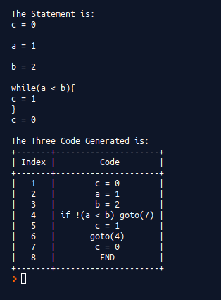
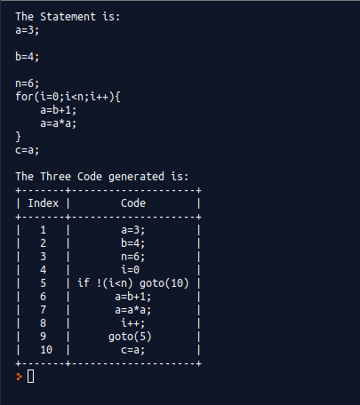
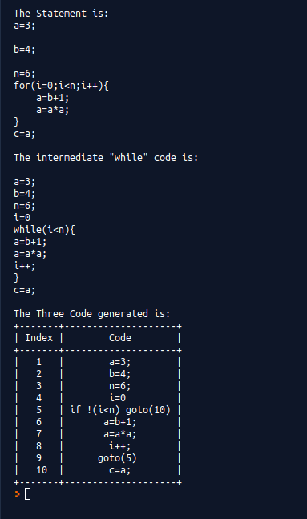
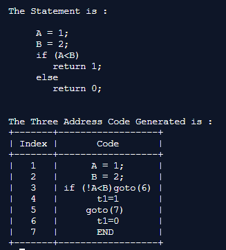

# Three-Address-Code-Compiler
Contains code for if-else and while loop and for loop generation in Three Address Code format.

Before running this, ensure that prettytable module is installed or else you can run
```
pip install prettytable
```

[Source code for for loop](For_Loop/for.py)<br>
[Source code for while loop](While_Loop/while.py)<br>
[Source code for if-else statement](If_Else/if.py)


### Output

#### While loop



#### For loop

<table>
    <th>
        Without "while" intermediate
    </th>
    <th>
        With "while" intermediate
    </th>
<tr>
    <td>
        
    </td>
    <td>
        
    </td>
</tr>
</table>


#### While loop



### Contributors
- [@KaustubhDamania](https://github.com/KaustubhDamania)
- [@GaurangAthavale](https://github.com/GaurangAthavale)
- [@mihir2510](https://github.com/mihir2510)
- [@g-bhagwanani](https://github.com/g-bhagwanani)

